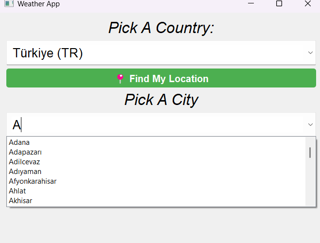
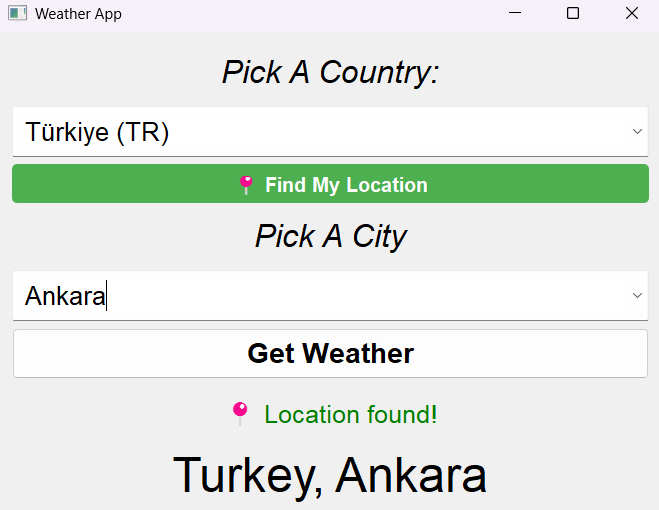

# 🌦️ Location-Based Weather App (PyQt5)

A lightweight and stylish desktop weather application built with PyQt5.  
Features country & city selection with **type-ahead search** and a clean UI.

  
  
  

---

## ✨ Features
- Country picker + **cities filtered to provinces only**
- **Instant search (type-ahead)** in both dropdowns
- Live weather data: temperature, description, emoji/icon
- Packaged `.exe` available under [Releases](../../releases)
- Single–file executable, no console window

---

## 🖼️ Screenshots

**1) Main Screen**  

**2) Country & City Search**  

---

## 🚀 How to Use
1. Download the latest `.exe` from the [Releases](../../releases) page.  
2. Run it — no setup required.  

---

## 🛠️ Tech Stack
- **Python** (PyQt5)
- **pycountry** (country list)
- **geonamescache** (province/city data)
- **requests** (weather API calls)
---
